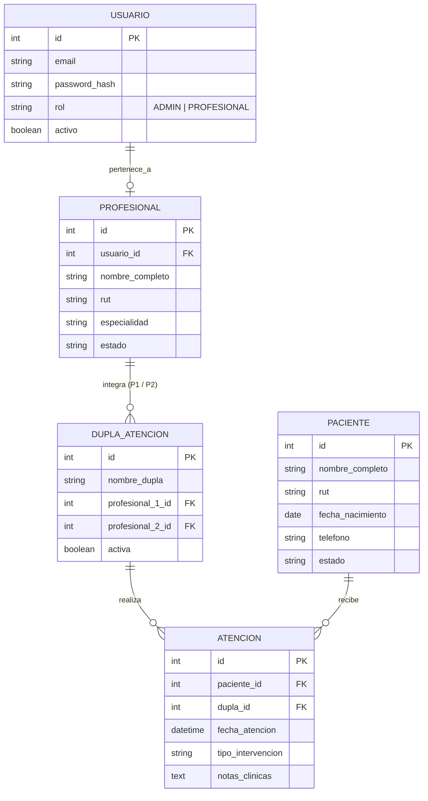

# PRD — SICOLOGIA DATA REPORT

**Documento de Requisitos de Producto (Product Requirements Document)**

---

## 01. Resumen del Producto

- **Nombre del producto:** SICOLOGIA DATA REPORT
- **Tagline:** Gestión clínica centralizada, trazabilidad por duplas y seguimiento seguro de pacientes.
- **Descripción:** Plataforma web responsive para el registro, almacenamiento seguro, búsqueda rápida y seguimiento clínico de pacientes mediante la conformación de duplas de atención profesional.

---

## 02. Problema y Justificación

Actualmente, la información de los pacientes y sus atenciones se gestiona en planillas de cálculo (Excel), lo cual genera:

- Dificultad y lentitud en la búsqueda y consulta de historiales.
- Falta de control y trazabilidad en las atenciones realizadas en dupla.
- Alto riesgo de inconsistencia, duplicidad y pérdida de datos clínicos sensibles.

---

## 03. Objetivos del Sistema

1. **Centralización y Seguridad:** Migrar los datos desde planillas a una base de datos relacional y segura con control de acceso por roles.
2. **Eficiencia en Búsquedas:** Reducir el tiempo de consulta y filtrado de fichas y atenciones a segundos.
3. **Gestión Operativa por Duplas:** Formalizar y registrar la atención multidisciplinaria de pacientes asignando duplas de profesionales a cada sesión.

---

## 04. Roles y Permisos (Control de Acceso - RBAC)

| Rol                     | Descripción                                                          | Permisos Clave                                                                                                                                                                                                            |
| :---------------------- | :------------------------------------------------------------------- | :------------------------------------------------------------------------------------------------------------------------------------------------------------------------------------------------------------------------ |
| **Administrador**       | Responsable de la administración técnica y operativa del centro.     | - Acceso exclusivo al panel de configuración. - Alta, baja y edición de profesionales clínicos. - Creación y activación/desactivación de **Duplas de Atención**. - Auditoría global y reportería administrativa. |
| **Profesional Clínico** | Psicólogos, terapeutas o especialistas que atienden a los pacientes. | - Inicio de sesión al portal clínico. - Consulta y búsqueda rápida de pacientes. - Registro y edición de atenciones clínicas asignando su dupla. - Visualización de su historial de atenciones.                  |

---

## 05. Requerimientos Funcionales (RF)

### RF-01: Autenticación y Seguridad

- **RF-01.1 Login con Control de Roles:** Acceso unificado con correo y contraseña, con redirección automática:
  - _Administrador:_ Panel de Gestión y Configuración.
  - _Profesional Clínico:_ Dashboard de Pacientes y Atenciones.
- **RF-01.2 Protección de Vistas:** Las secciones de administración de usuarios y configuración de duplas solo son accesibles y visibles para el rol Administrador.

### RF-02: Gestión de Profesionales y Duplas (Módulo Administrador)

- **RF-02.1 Registro de Profesionales:** Formulario para registrar profesionales con: Nombre, RUT/Identificador, Especialidad, Correo y Estado (Activo/Inactivo).
- **RF-02.2 Configuración de Duplas de Atención:** Formulario para asociar dos profesionales activos en una dupla (ej: _Psicólogo + Terapeuta_), asignando un nombre o código identificador.
- **RF-02.3 Disponibilidad Inmediata:** Las duplas activas quedan habilitadas al instante para ser seleccionadas en los registros clínicos.

### RF-03: Gestión de Pacientes y Atenciones (Módulo Clínico)

- **RF-03.1 Ficha de Paciente:** Registro y edición de datos generales del paciente (Nombre, RUT/ID, fecha de nacimiento, contacto, estado del caso).
- **RF-03.2 Registro de Sesión/Atención:** Formulario para registrar cada sesión clínica seleccionando la **Dupla de Atención** responsable, fecha, tipo de intervención y observaciones.
- **RF-03.3 Tabla Dinámica de Atenciones:** Vista en tabla con columnas: Fecha, Paciente, **Dupla de Atención (ambos profesionales)**, Tipo de Sesión y Acciones.
- **RF-03.4 Búsqueda y Filtros Rápidos:** Buscador en tiempo real por RUT, nombre de paciente, profesional o dupla.

---

## 06. Modelo de Datos (Entidades Principales)

